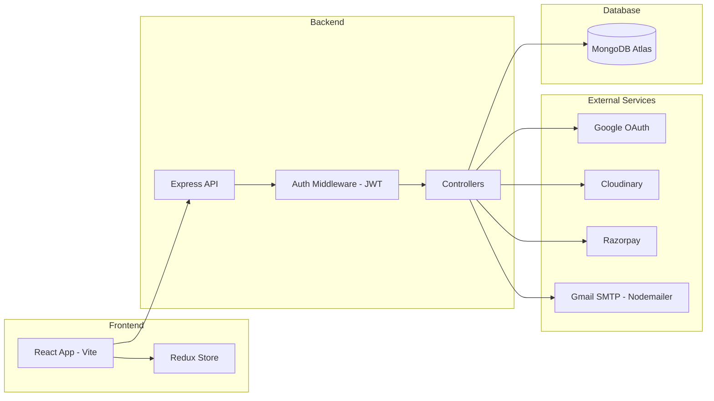
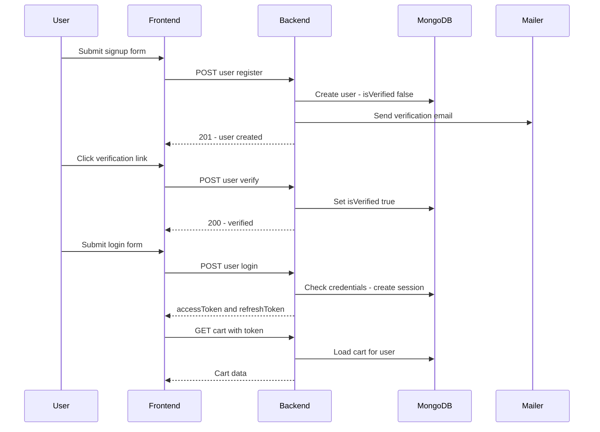
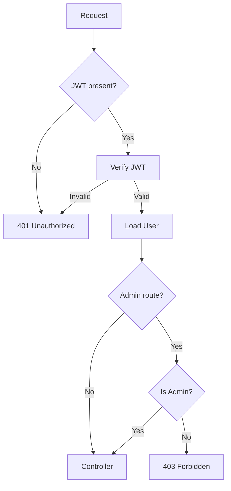
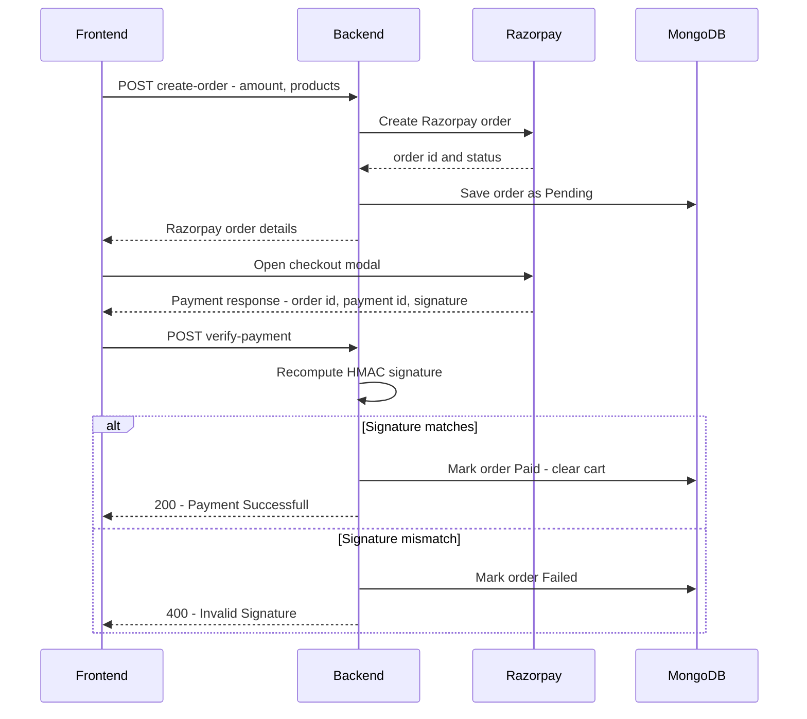
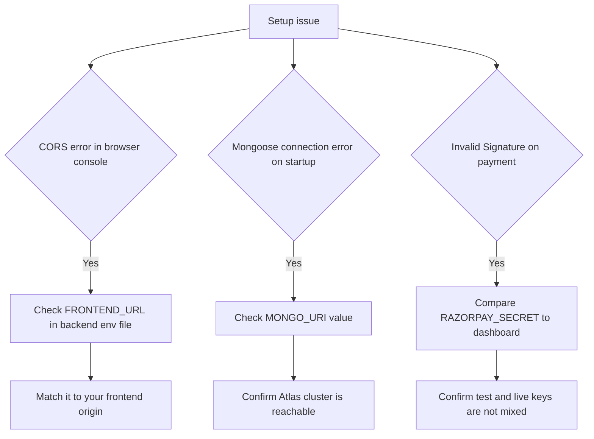

<div align="center">

# 🛒 Zeptronics⚡

> *🛒 "A full-stack electronics marketplace — browse, cart, verify, and check out — without the clutter of a generic retail template."*

<br/>


<div align="center">

<!-- Frontend -->


<!-- State Management -->


<!-- Styling & UI -->


<!-- Backend -->


<!-- Database -->


<!-- Auth -->


<!-- File Uploads & Media -->


<!-- Payments -->


<!-- Email -->


<!-- License -->


</div>

<br/>


**🚀 Jump to:** [✨ Features](#-what-it-does) · [🏗️ Architecture](#-architecture) · [⚙️ How It Works](#-how-it-works) <br/>· [💳 Payment Integration](#-payment-integration) · [📦 Installation](#-installation) · [📚 API Reference](#-api-reference) <br/> · [🛠️ Troubleshooting](#-troubleshooting) · [🤝 Contributing](#-contributing)


---

## 💡 The Problem

Most e-commerce sites are built for "sell anything," which means electronics shoppers get generic categories, weak filtering, and a checkout flow that was never designed around technical products or admin-heavy catalogs. 

Zeptronics exists because electronics deserve their own storefront: real product management, verified accounts, a cart that behaves, and a payment flow that you can actually trust.

## 🚀 What It Does

| Feature | Description |
|---|---|
| ✉️ Account verification | Email verification via JWT + Nodemailer (`usercontroller.js`, `verifyEmail.js`) |
| 🔐 Full auth suite | Login, logout, password reset, OTP verification, password change |
| 🔑 Google OAuth | Passport.js-based Google login (`authRoutes.js`) |
| 🛍️ Product CRUD | Admin product management with Cloudinary image uploads (`cloudinary.js`) |
| 🛒 Cart engine | Add / update quantity / remove, fully scoped to the authenticated user |
| 💳 Payments | Razorpay order creation + signature verification (`orderController.js`) |
| 📦 Order history & analytics | Per-user order history plus admin sales aggregation in MongoDB |
| ⚛️ Redux-backed state | Session and cart persistence across the app |
| 🛡️ Route protection | User-only and admin-only routes (`ProtectedRoutes.jsx`) |


## 🧩 Architecture


<br/>

Every authenticated request passes through the JWT middleware before it ever reaches a controller, and every controller talks to exactly one of the four external dependencies above — never directly to the frontend.

## 🛠️ Tech Stack

| Layer | Technology |
|---|---|
| 🖥️ Frontend | React 19, Vite, React Router, Axios |
| 🧠 State management | Redux Toolkit, Redux Persist |
| 🎨 UI | Tailwind CSS 4, shadcn/ui, Lucide React, Sonner |
| ⚙️ Backend | Node.js, Express 5 |
| 🗄️ Database | MongoDB Atlas, Mongoose |
| 🔐 Authentication | JWT, bcryptjs, Passport, passport-google-oauth20 |
| 📤 File upload | Multer, Cloudinary |
| 💳 Payments | Razorpay |
| 📧 Email | Nodemailer (Gmail SMTP) |

## 📸 Screenshots


```md


```

## ⚙️ How It Works

- **Signup → Verify**: `Signup.jsx` posts to `/api/v1/user/register`, which hashes the password, creates the user, and emails a JWT verification link. `VerifyEmail.jsx` posts that token to `/api/v1/user/verify`, which flips `isVerified` to `true`.
- **Login**: `/api/v1/user/login` checks credentials, issues `accessToken` + `refreshToken`, and replaces any existing session in the `Session` collection.
- **Google OAuth**: `/auth/google` → Passport's Google strategy → `/auth/google/callback` issues a JWT and redirects to `/auth-success?token=...`, where the frontend stores it and calls `/auth/me`.
- **Cart**: Every cart route reads `req.id` from the auth middleware, so all cart state is inherently user-scoped — no cross-account leakage.
- **Checkout**: `AddressForm.jsx` triggers `/api/v1/orders/create-order`, which opens a Razorpay order and stores a `Pending` record. After payment, `/api/v1/orders/verify-payment` recomputes the HMAC signature server-side and only marks the order `Paid` (and clears the cart) if it matches.
- **Admin analytics**: `getSalesData` runs a MongoDB aggregation (`$match` → `$group` → `$dateToString`) to produce daily sales totals for the dashboard.

<br/> 

**Request lifecycle at a glance:**



<br/>

**Auth middleware - how a protected route decides who gets through:**




## 💳 Payment Integration

Zeptronics never trusts the client's word that a payment succeeded. The frontend only ever sees a Razorpay order and a payment response — the backend is the only party allowed to decide whether an order becomes `Paid`, and it does that by recomputing the payment signature itself.

<br/>



<br/>

Key points:
- The signature is recomputed server-side with `RAZORPAY_SECRET` using HMAC-SHA256 over `razorpay_order_id|razorpay_payment_id`.
- A cart is only cleared once the order is confirmed `Paid` — never on the client's say-so.
- A signature mismatch always flips the order to `Failed` and returns a `400`, regardless of what the frontend claims happened.


## 📦 Installation

1. **Install backend dependencies**
   ```bash
   cd backend
   npm install
   ```
2. **Install frontend dependencies**
   ```bash
   cd ../frontend
   npm install
   ```
3. **Configure environment variables** — create `backend/.env`:
   ```bash
   PORT=8000
   MONGO_URI=your_mongodb_connection_string
   MAIL_USER=your_gmail_address
   MAIL_PASS=your_gmail_app_password
   SECRET_KEY=your_jwt_secret
   GOOGLE_CLIENT_ID=your_google_client_id
   GOOGLE_CLIENT_SECRET=your_google_client_secret
   CLIENT_URL=http://localhost:5173
   CLOUD_NAME=your_cloudinary_cloud_name
   API_KEY=your_cloudinary_api_key
   API_SECRET=your_cloudinary_api_secret
   RAZORPAY_KEY_ID=your_razorpay_key_id
   RAZORPAY_SECRET=your_razorpay_secret
   SERVER_URL=http://localhost:8000
   ```
4. **Run the backend**
   ```bash
   cd backend
   npm start
   ```
5. **Run the frontend**
   ```bash
   cd frontend
   npm run dev
   ```

## 📁 Project Structure

```text
Zaptronics/
├── backend/
│   ├── server.js
│   ├── config/            # passport.js, razorpay.js
│   ├── controllers/       # cart, order, product, user
│   ├── database/          # db.js
│   ├── emailVerify/       # OTP + verification emails
│   ├── middleware/        # isAuthenticated.js, multer.js
│   ├── models/            # cart, order, product, session, user
│   ├── routes/            # auth, cart, order, product, user
│   └── utils/             # cloudinary.js, dataUri.js
└── frontend/
    └── src/
        ├── App.jsx
        ├── main.jsx
        ├── components/     # ProductCard, ProtectedRoutes, Navbar, etc.
        ├── pages/          # Login, Signup, Cart, Products, admin/...
        └── redux/          # productSlice.js, store.js, userslice.js
```

## 📡 API Reference

| Method | Endpoint | Description | Auth |
|---|---|---|---|
| POST | `/api/v1/user/register` | Register + send verification email | No |
| POST | `/api/v1/user/verify` | Verify account via JWT | Token in header |
| POST | `/api/v1/user/reverify` | Resend verification email | No |
| POST | `/api/v1/user/login` | Login, issue tokens | No |
| POST | `/api/v1/user/logout` | Clear session | Yes |
| POST | `/api/v1/user/forgot-password` | Send OTP for reset | No |
| POST | `/api/v1/user/verify-otp/:email` | Verify OTP | No |
| POST | `/api/v1/user/change-password/:email` | Set new password | No |
| GET | `/api/v1/user/all-user` | List all users | Admin |
| GET | `/api/v1/user/get-user/:userId` | Fetch user by ID | Yes |
| PUT | `/api/v1/user/update/:id` | Update profile | Yes |
| GET | `/auth/google` | Start Google OAuth | No |
| GET | `/auth/google/callback` | Google OAuth callback | No |
| GET | `/auth/me` | Current session profile | Yes |
| POST | `/api/v1/product/add` | Add product + images | Admin |
| GET | `/api/v1/product/getallproducts` | List catalog | No |
| DELETE | `/api/v1/product/delete/:productId` | Delete product | Admin |
| PUT | `/api/v1/product/update/:productId` | Update product | Admin |
| GET | `/api/v1/cart/` | Get current cart | Yes |
| POST | `/api/v1/cart/add` | Add to cart | Yes |
| PUT | `/api/v1/cart/update` | Change quantity | Yes |
| DELETE | `/api/v1/cart/remove` | Remove item | Yes |
| POST | `/api/v1/orders/create-order` | Create Razorpay order | Yes |
| POST | `/api/v1/orders/verify-payment` | Verify payment signature | Yes |
| GET | `/api/v1/orders/myorder` | User order history | Yes |
| GET | `/api/v1/orders/all` | All orders | Admin |
| GET | `/api/v1/orders/user-order/:userId` | Orders for one user | Admin |
| GET | `/api/v1/orders/sales` | Sales analytics | Admin |

<details>
<summary><strong>Example — Register + Login</strong></summary>

```json
POST /api/v1/user/register
{ "firstName": "John", "lastName": "Doe", "email": "john@example.com", "password": "Pass@123" }

201 →
{ "success": true, "message": "User registered Successfully",
  "user": { "_id": "64f2c1eabc1234", "email": "john@example.com", "isVerified": false } }
```

```json
POST /api/v1/user/login
{ "email": "john@example.com", "password": "Pass@123" }

200 →
{ "success": true, "message": "Welcome back John",
  "user": { "_id": "64f2c1eabc1234", "role": "user" },
  "accessToken": "jwt-access-token", "refreshToken": "jwt-refresh-token" }
```
</details>

<details>
<summary><strong>Example — Cart operations</strong></summary>

```json
POST /api/v1/cart/add
{ "productId": "64f2c1eabc5678" }

200 →
{ "success": true, "message": "Product added successfully",
  "cart": { "items": [{ "productId": "64f2c1eabc5678", "quantity": 1, "price": 1299 }], "totalPrice": 1299 } }
```
</details>

<details>
<summary><strong>Example — Checkout + payment verification</strong></summary>

```json
POST /api/v1/orders/create-order
{ "products": [{ "productId": "64f2c1eabc5678", "quantity": 1 }],
  "amount": 2199, "tax": 132, "shipping": 49, "currency": "INR" }

200 →
{ "success": true,
  "order": { "id": "order_abc123", "amount": 219900, "currency": "INR", "status": "created" },
  "dbOrder": { "_id": "64f2c1eabc9876", "status": "Pending", "razorpayOrderId": "order_abc123" } }
```

```json
POST /api/v1/orders/verify-payment
{ "razorpay_order_id": "order_abc123", "razorpay_payment_id": "pay_xyz789",
  "razorpay_signature": "signature-hash" }

200 →
{ "success": true, "message": "Payment Successfull",
  "order": { "_id": "64f2c1eabc9876", "status": "Paid" } }
```
</details>

## 🩹 Troubleshooting

**Quick diagnosis — start here:**



<details>
<summary><strong>"Not allowed by CORS: http://localhost:5173"</strong></summary>

`backend/server.js` only accepts origins listed in `allowedOrigins`. If your frontend runs on a different port, or `FRONTEND_URL` doesn't match, requests get blocked before they reach any controller.

**Fix:**
```bash
# backend/.env
FRONTEND_URL=http://localhost:5173
```
</details>

<details>
<summary><strong>"MongoDB connection failed: MongooseServerSelectionError"</strong></summary>

`backend/database/db.js` connects using `process.env.MONGO_URI`. A missing, malformed, or unreachable connection string prevents the app from starting.

**Fix:**
```bash
cd backend
node -e "console.log(process.env.MONGO_URI)"
```
Update `MONGO_URI` in `backend/.env` with a valid MongoDB Atlas connection string.
</details>

<details>
<summary><strong>"Invalid Signature" on payment verification</strong></summary>

`orderController.js` recomputes the Razorpay HMAC using `RAZORPAY_SECRET`. A mismatch between your backend secret and your Razorpay dashboard key (test vs. live) causes every verification to fail.

**Fix:**
```bash
RAZORPAY_KEY_ID=your_key_id
RAZORPAY_SECRET=your_secret
```
Confirm both values match the same mode (test or live) in the Razorpay dashboard.
</details>


## 🔒 Privacy & Safety Note

This project handles payment data (Razorpay) and personal information (email, address, phone). Never commit `.env` files or real API secrets to version control, and always verify Razorpay signatures server-side before marking an order paid — never trust client-reported payment status alone.

## 🤝 Contributing

```bash
git clone <repository-url>
cd Zaptronics
git checkout -b feature/my-change
```

Make your change in `backend/` or `frontend/`, then:

```bash
git status
git add .
git commit -m "Add my feature"
git push origin feature/my-change
```

Open a pull request describing what changed, why, which routes/screens were affected, and any new environment variables. Before submitting, run:

```bash
cd backend && npm start
cd ../frontend && npm run build
```

## 📄 License & Contact

No license file is currently present in this repository, so no open-source license is declared. For repository questions, use the GitHub issue tracker or the maintainer contact configured outside this codebase.

---

[🔝 Back to top](#-zeptronics)